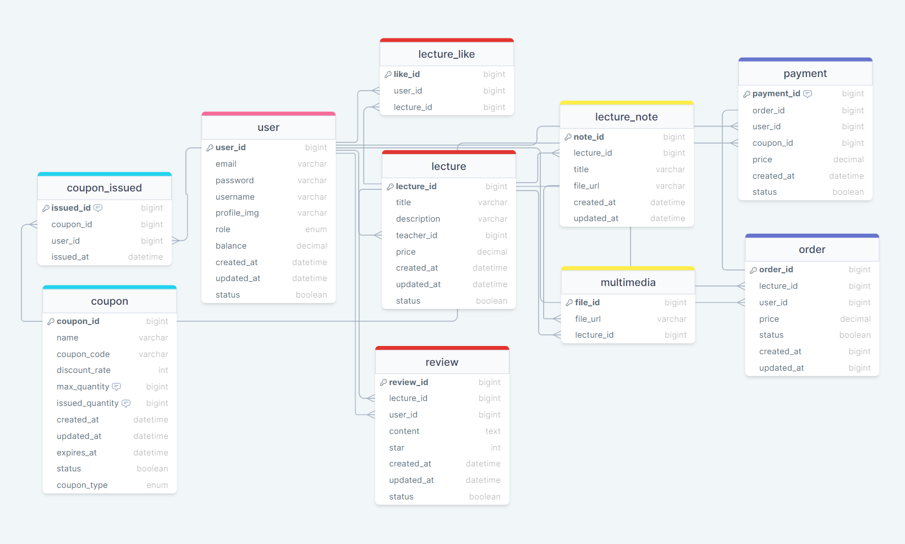

# 늘품: 온라인 강의 플랫폼
(* 늘품: 앞으로 좋게 발전할 품질이나 품성)

# 목차
1. 프로젝트 소개
2. 개발 환경
3. 기능 소개
4. 프로젝트 구조
5. API 명세서
6. ERD
7. 프로젝트 기록 및 트러블슈팅

# 프로젝트 소개
- 역할의 구분 없이 서로의 지식을 공유하는 서비스
- msa 구조 채택

# 개발 환경
- programming language: `Java 17`
- framework: `Spring Boot 3.2.2`, `Spring Security`
- database: `MySQL`, `Redis`
- ORM: `JPA`
- IDE: `IntelliJ`
- version control : `git`, `github`
- containerization: `Docker`, `Docker-compose`
- cloud services: `AWS S3`

# 기능 소개
- 유저 관리
- [x] 이메일 인증을 통한 회원가입
- [x] jwt 토큰을 이용한 인증/인가
- [x] 관리자/유저로 구분


- 쿠폰 생성 및 발급
- [x] 선착순 쿠폰/일반 쿠폰으로 구분
- [x] 선착순 쿠폰은 한정된 수량만큼만 발급 가능
- [x] 동시성 이슈로 인한 장애 격리를 위해 모듈 분리


- 강의/강의 자료 관리
- [x] 학생/강사 구분 없이 모두 자신만의 강의를 등록 가능
- [x] 강의 등록 시 멀티미디어 파일은 AWS S3에 저장
- [x] 강의 목록 조회 시 성능 향상을 위해 강의 자료 모듈과 분리


- 주문 및 결제 기능
- [x] 동시성 이슈로 인한 장애 격리를 위해 모듈 분리
- [x] 주문 시에 쿠폰 모듈에서 정보 받아와 결제 모듈로 전송
- [x] 결제 성공 시에만 쿠폰 만료 처리

# 프로젝트 실행 방법
- 프로젝트 클론 및 docker 설치 후 로컬 환경에서 순차적으로 실행
1. 프로젝트 클론

   ```
    git clone https://github.com/neul-poom/backend.git
    ```


2. 도커 컴포즈 명령어 실행

   ```
    docker-compose up -d
   ```

3. 각 모듈별 application-dev.yml 파일 작성
   <details>
   <summary>(작성 예시)</summary>

   ```yaml
   server:
     port: 

   spring:
     config:
       activate:
         on-profile: 
     jwt:
       secret: 
       access-token-valid-time: 
       refresh-token-valid-time: 
       expiration: 
       header: 
       prefix: 
     
   datasource:
     url: 
     username: 
     password: 
     driver-class-name: 
   
   jpa:
     hibernate:
       ddl-auto: 
   
   data:
     redis:
       port: 
       host: 
   
   mail:
     host: 
     port: 
     username: 
     password: 
     auth-code-expiration-millis: 
     properties:
       mail:
         smtp:
           starttls:
             enable: 
             required: 
           auth: 
           connectiontimeout: 
           timeout: 
           writetimeout: 
      </details>
    ```

   
  
4. .env 파일 생성
   ```
   MYSQL_ROOT_PASSWORD=
   ```
   
5. 각 모듈 실행

# 프로젝트 구조
- 사진 첨부

- 패키지 구조

| Service	             | Description	    | Authorization	 | Port   |
|:---------------------|:----------------|:---------------|:-------|
| [`API Gateway`]      | 요청 인증 및 라우팅     | jwt 토큰 인증      | `8080` |
| [`User`]             | 사용자 관련 작업 관리)   | jwt 토큰 발급      | `8081` |
| [`Lecture`]          | 강의 도메인 작업 관리    |                | `8082` |
| [`Coupon`]           | 쿠폰 도메인 작업 관리    |                | `8083` |
| [`Payment`]          | 결제 도메인 작업 관리    |                | `8084` |
| [`Lecture Resource`] | 강의 자료 도메인 작업 관리 |                | `8085` |
| [`Order`]            | 주문 도메인 작업 관리    |                | `8086` |


# API 명세서
- [[보러가기]](https://documenter.getpostman.com/view/28398906/2sA3kSn2om)

# ERD


# 프로젝트 기록
- msa 구조 채택 이유 [보러가기]
- FeignClient 선택 이유 [[보러가기]](https://cod2048.tistory.com/43)
- AWS S3 연결하기 [[보러가기]](https://cod2048.tistory.com/44)
- Redis로 이메일 인증 구현하기 [보러가기]

# 트러블 슈팅
- 선착순 쿠폰 동시성 문제 [보러가기]
- 좋아요 동시성 문제 [보러가기]
- msa 구조에 적합한 api gateway 인증/인가 처리 [보러가기]
